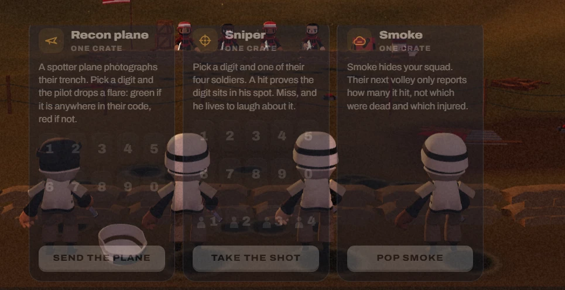

# 01. Supply cards, faded over the field (desktop)

| | |
|---|---|
| File | `01-supply-cards-faded.webp` |
| Size | 965 x 496 px, WebP |
| Source | Dead & Injured, live build, desktop match screen with the Supplies tab open |
| Sent | First batch of corrections, screenshot 1 of 12 |
| Status | Current UI, marked by the owner as needing a fix |

## What the owner said

> "Needs to be fixed ... and also I want the supplies to be 3 3d Icons Click to learn about it and use it that kinda thing you get Nice beautiful UI"

(Quoted from the first correction message, trimmed to the parts about this screenshot.)

## In one paragraph

A crop of the desktop match screen with the Supplies tab open. Three cards stand side by side: **Recon plane**, **Sniper** and **Smoke**. Each card carries an icon tile, a title, a "ONE CRATE" price, a paragraph explaining the supply, the pickers you need (digits, and for the sniper a row of soldier spots) and a full-width action button. All three cards are drawn at about half opacity because supplies cannot be used at this moment, so the 3D battlefield behind them shows straight through: the player's own soldiers stand "inside" the cards, their white helmets sitting on top of the digit keys, and the enemy soldiers cut through the card titles. The result reads as a ghosted, glitchy layer rather than a deliberate "unavailable" state, and none of it looks like it belongs to the toy-soldier world.

## Layout and composition

- The crop covers the lower middle of a desktop screen. The cards occupy the left 85% of the crop; the right 140 px show only the field.
- Three equal cards, each about 247 px wide and 438 px tall, with a gap of about 16 px:
  - Card 1, Recon plane: x from about 50 to 297, y from about 42 to 480.
  - Card 2, Sniper: x from about 313 to 560.
  - Card 3, Smoke: x from about 577 to 824.
- Inside every card, top to bottom: a header row (icon tile, title, price), the description paragraph, the picker area, and the action button pinned to the bottom edge (y from about 420 to 462). The buttons line up across all three cards.
- The screenshot appears to be at roughly 1.1x scale compared with the CSS sizes (the desktop dock is 700 px wide in CSS, and the three cards here span about 775 px), so the browser was probably zoomed or the display scaled.
- The cards sit directly in front of the player's trench, which is exactly where the four soldiers of the player's squad stand, so every soldier overlaps a card.

## Element by element

### Card 1: Recon plane

- **Icon tile**: a rounded square (about 34 px) with a dark amber tint, holding an amber outline glyph of a paper plane (a "send" arrow shape).
- **Title**: "Recon plane", heavy weight, white.
- **Price**: "ONE CRATE", small uppercase with wide letter spacing, muted grey.
- **Description**: "A spotter plane photographs their trench. Pick a digit and the pilot drops a flare: green if it is anywhere in their code, red if not." It wraps to five lines.
- **Picker**: two rows of five digit keys: 1 2 3 4 5 and 6 7 8 9 0. The keys are dark rounded squares, but at this opacity their shapes disappear and only the faint numerals remain, floating over a soldier's head and a fallen helmet.
- **Button**: "SEND THE PLANE", a pale greyish-cream fill with dark uppercase text, full card width.

### Card 2: Sniper

- **Icon tile**: the same amber tile with a crosshair glyph (a circle with four ticks).
- **Title and price**: "Sniper", "ONE CRATE". Two enemy soldiers in red helmets stand directly behind the title and price, so red figures cut through the letters.
- **Description**: "Pick a digit and one of their four soldiers. A hit proves the digit sits in his spot. Miss, and he lives to laugh about it." Four lines.
- **Picker**: two rows of digit keys (1 to 5, 6 to 0), then a row of four "spot" keys, each showing a small person silhouette and a number from 1 to 4.
- **Button**: "TAKE THE SHOT".

### Card 3: Smoke

- **Icon tile**: a cloud glyph, drawn in a warmer red-orange than the other two icons.
- **Title and price**: "Smoke", "ONE CRATE".
- **Description**: "Smoke hides your squad. Their next volley only reports how many it hit, not which were dead and which injured." Four lines.
- **No picker**. The large empty middle of the card shows a soldier through it.
- **Button**: "POP SMOKE".

### The world behind the cards

- **Top edge**: a red flag with a white skull (the enemy flag) is cut off at the top left, above card 1. The enemy sandbag line runs across the top, with four enemy soldiers in red helmets visible behind the Sniper and Smoke headers, a wooden crate on the enemy line, and barbed-wire posts in no man's land.
- **Middle**: the player's four soldiers seen from behind: white helmets with a black band, white tunics, dark sleeves, brown trousers. The far-left soldier has lost his helmet (dark hair shows) and his white helmet lies upside down on the ground in front of card 1, knocked off by an earlier hit.
- **Ground**: dark craters, sandbags along the player's trench, warm brown dirt.

## Typography

- One typeface throughout: Archivo, a grotesque sans with a width axis, loaded from `/fonts/archivo-latin.woff2`.
- In CSS: titles are 15 px at weight 850 with a widened width axis; the price line is 10 px uppercase at weight 800 with 0.12em letter spacing; the description is 13 px at a 1.38 line height; buttons are small uppercase with wide tracking.
- At half opacity, the description paragraphs become light grey on mid brown. They are the least readable thing on screen.

## Colour (sampled from the screenshot)

| Where | Hex |
|---|---|
| Card surface, over the field | `#342523` |
| Icon tile | `#40301f` |
| Button fill (cream at half opacity) | `#524843` |
| Field, top right corner | `#502d12` |
| A white helmet seen through a card | `#675456` |

Overall palette: burnt orange and brown dusk ground, desaturated greys where the cards sit, amber icon accents, a few red enemy helmets.

## State shown

- All three cards are in the "off" state. The game dims a card to 50% opacity whenever that supply cannot be used: it is not the player's turn, a supply was already used this turn, there are no crates left, or (for smoke) smoke is already up.
- The buttons still look pressable (light fill) even though they are disabled, which contradicts the dimmed card around them.
- No digit or spot is selected in any card.

## What is wrong with it

1. **Legibility**: text and keys sit on busy 3D content with no solid backdrop, so the numerals and paragraphs fight the soldiers behind them.
2. **The disabled look reads as a glitch**: see-through panels suggest a rendering fault, not "you cannot use this now".
3. **Too much at once**: three paragraphs, twenty digit keys, four spot keys and three buttons are all on screen together on desktop.
4. **Wrong visual language**: flat web cards (rounded rectangles, grey buttons, tracked caps labels) with nothing of the clay toy-soldier world in them.
5. **They hide the wrong thing**: the cards cover the player's own squad, which is the part of the scene that reacts to supplies.

## Notes for the redesign (observations only, nothing built yet)

- The owner wants each supply to be a single 3D icon, three in total. Clicking an icon explains that supply and lets you use it, so the text, pickers and button would only appear for the one supply you open.
- An unavailable supply needs a clear solid state (for example a darkened icon, an empty crate count or a padlock) instead of transparency.
- 3D objects that already exist in the game and could become these icons: the spotter plane model (`web/src/client/scene/plane.js`), the sniper's rifle and scope from the soldier model, and smoke (the smoke screen effect already exists in `scene/fx.js`; a smoke canister could be modelled in the same vertex-coloured toy style).

## Where it lives in the code

- Markup: `web/src/client/index.html`, the `#paneSupplies` pane, holding `#deck` with three `article.supply[data-power]` cards (recon, sniper, smoke).
- Styles: `web/src/client/style.css`, rules `.supply`, `.supply.off { opacity: 0.5 }`, `.pick`, `.deck`, and the three-column grid inside the `@media (min-width: 900px)` block.
- Logic: `web/src/client/match.js`, `refresh()` (sets `.off` and `.ready`), `picker()`, `usePower()`.
