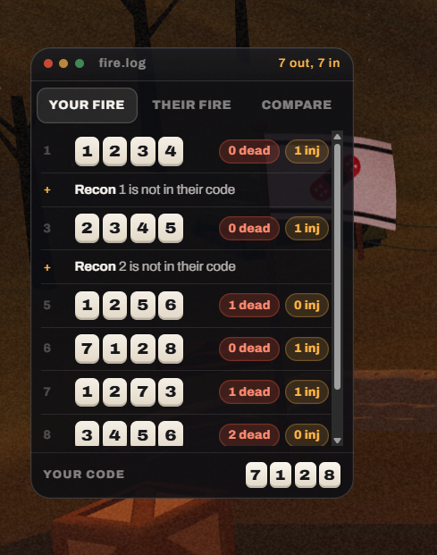

# 02. The fire log window (desktop)

| | |
|---|---|
| File | `02-fire-log-window.png` |
| Size | 489 x 621 px, PNG |
| Source | Dead & Injured, live build, desktop match screen, the log window on the left side of the field |
| Sent | First batch of corrections, screenshot 2 of 12 |
| Status | Current UI, marked by the owner as needing a fix |

## What the owner said

> "Needs to be fixed the logs should be able to be hidden if the user wants there should be a minimize button or something"

## In one paragraph

A dark, rounded window titled **fire.log** that lists every shot the player has fired in this match. It has a fake desktop title bar (three coloured dots like macOS window controls), a counter "7 out, 7 in", a three-way switch (**YOUR FIRE**, **THEIR FIRE**, **COMPARE**), a scrolling list of volleys (four cream number tiles per guess, then a red "dead" pill and an amber "inj" pill) mixed with supply reports marked "+", a native grey scrollbar, and a footer that shows the player's own code. On desktop this window is always open, pinned over the left side of the field, and cannot be minimised or closed.

## Layout and composition

- Window bounds in the crop: about x 35 to 395, y 53 to 555 (360 x 502 px), with a corner radius of about 18 px, a one-pixel light border and a soft drop shadow.
- Four horizontal bands:
  1. **Title bar** (about 36 px tall): three dots at the left (red, amber, green), the label "fire.log" next to them, and "7 out, 7 in" right aligned in amber.
  2. **Switch** (about 46 px): three equal segments, "YOUR FIRE" selected.
  3. **List** (about 350 px, scrolls): one row per volley or supply.
  4. **Footer** (about 48 px): "YOUR CODE" on the left and four cream tiles on the right.
- A thin vertical scrollbar runs down the right side of the list (about x 372 to 382), with small arrow buttons at the top and bottom and a grey thumb covering most of the track.

## Element by element

### Title bar

- **Three dots**: red `#c64934`, amber `#bb8639`, green `#3f8954`, each about 8 px. They copy the macOS close, minimise and zoom buttons, but they are decoration: clicking them does nothing. This is exactly the control the owner is asking for (minimise), drawn but not working.
- **"fire.log"**: small grey text, styled like a file name.
- **"7 out, 7 in"**: amber, right aligned. It counts the player's volleys (out) and the opponent's (in).

### Switch

- **YOUR FIRE**: selected. A dark filled pill (`#292828`) with a one-pixel light outline and white bold uppercase text.
- **THEIR FIRE** and **COMPARE**: unselected, grey uppercase text on the window background.

### List rows (top to bottom)

Each volley row has a dim number in a narrow left gutter, four cream number tiles showing the guess, and two result pills on the right. Each supply row has an amber "+" in the gutter and a sentence.

| Gutter | Guess tiles | Result |
|---|---|---|
| 1 | 1 2 3 4 | red pill "0 dead", amber pill "1 inj" |
| + | | **Recon** 1 is not in their code |
| 3 | 2 3 4 5 | "0 dead", "1 inj" |
| + | | **Recon** 2 is not in their code |
| 5 | 1 2 5 6 | "1 dead", "0 inj" |
| 6 | 7 1 2 8 | "0 dead", "1 inj" |
| 7 | 1 2 7 3 | "1 dead", "1 inj" |
| 8 | 3 4 5 6 | "2 dead", "0 inj" (cut off by the bottom of the scroll area) |

- **Number tiles**: small cream squares (about 26 x 30 px) with dark heavy numerals and a darker bottom edge, like keycaps.
- **Dead pill**: dark red fill (`#3d1e1a`) with a thin red outline and red text.
- **Injured pill**: dark amber fill (`#443527`) with a thin amber outline and amber text.
- **Supply rows**: "Recon" in bold white, the rest of the sentence in grey, slightly smaller than the volley rows.
- Rows are separated by thin horizontal lines.

### An observed bug: the numbers skip

The gutter reads 1, +, 3, +, 5, 6, 7, 8. Numbers 2 and 4 are missing because the list counter also counts the two recon rows, even though those rows show a "+" instead of a number. The volleys are really the player's 1st to 6th shots. (In `style.css`, `.log li::before` increments the counter and `.log li.power::before` only changes the content, so supply rows still consume a number.)

### Footer

- **"YOUR CODE"**: small uppercase grey label with wide tracking.
- **Tiles**: 7 1 2 8, the player's own secret code, in the same cream tile style.

### Background

- The window sits over the left side of the field: a dark tree trunk at the top, the player's white flag with the red bandage emblem peeking out behind the window's right edge (about x 380 to 440, y 150 to 270), and a wooden crate at the bottom of the crop (about x 60 to 240, y 570 to 621).

## Typography

- Archivo throughout. The tab labels and "YOUR CODE" are small uppercase with wide tracking; numbers in tiles are heavy with tabular figures; pills are 11 to 12 px bold.

## Colour (sampled from the screenshot)

| Where | Hex |
|---|---|
| Window body | `#131012` |
| Title bar | `#1a181a` |
| List row background | `#131112` |
| Selected tab fill | `#292828` |
| Dead pill fill | `#3d1e1a` |
| Injured pill fill | `#443527` |
| Dots: red, amber, green | `#c64934`, `#bb8639`, `#3f8954` |
| Field behind | `#302111` |

## Interaction and state

- The switch changes the list: your volleys, theirs, or both side by side (Compare). The choice is remembered in the browser.
- The list scrolls; new rows animate in and the list scrolls to the bottom.
- On desktop the window is fixed at the left side of the screen and is always visible during a match. There is no way to hide it. On phones the log is a tab in the bottom dock instead.

## What is wrong with it

1. **Cannot be hidden**: it permanently covers part of the field on desktop.
2. **Fake window controls**: the three dots promise close, minimise and zoom and do nothing.
3. **Developer metaphor**: "fire.log", a file name, and macOS window chrome belong to a code editor, not a trench war.
4. **Native scrollbar**: the default grey scrollbar with arrow buttons clashes with the custom styling.
5. **Skipping numbers**: as described above.

## Notes for the redesign (observations only, nothing built yet)

- The owner wants a minimise button (and close) on this window, and wants the bottom of the screen to work like the Windows taskbar in screenshot 04: the log becomes one icon in that bar, minimised windows go back into their icon, and a small marker under an icon shows it is open.
- If the window keeps a title bar, its controls should really work, and the styling should come from the game's world (for example a field notebook or a clipboard of dispatches) rather than an operating system.
- The row numbering should count volleys only.

## Where it lives in the code

- Markup: `web/src/client/index.html`, `#paneLog` containing `#logWin` (`.win.logwin`), `#logSeg`, `#logs` with `#mineLog` and `#theirLog`, and `.mycode`.
- Styles: `web/src/client/style.css`, `.log`, `.log li`, `.log li::before` (the counter), `.log li.power`, `.seg`, `.mycode`, and the desktop rule `.log-pane { position: fixed; left: var(--pad); ... }`.
- Logic: `web/src/client/match.js`, `renderLogs()` and `logView()`.
