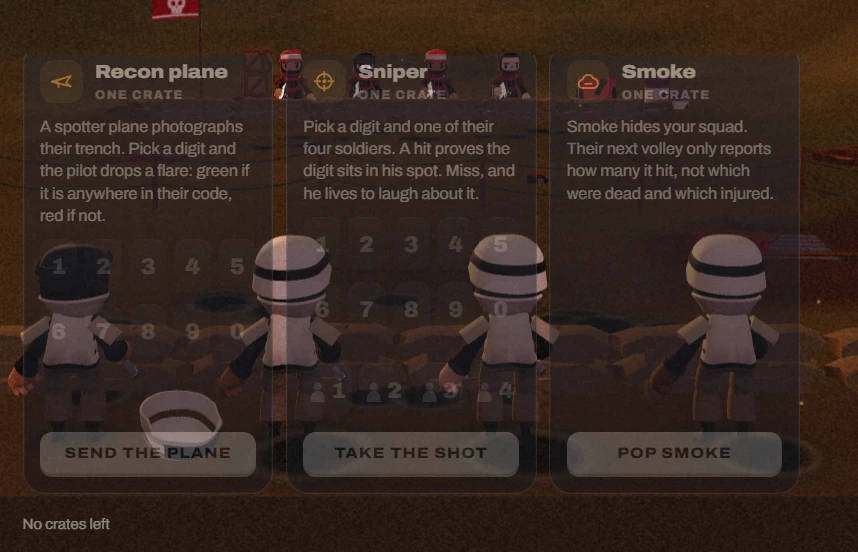

# 03. Supply cards with no crates left (desktop)

| | |
|---|---|
| File | `03-supply-cards-no-crates.webp` |
| Size | 858 x 552 px, WebP |
| Source | Dead & Injured, live build, desktop match screen with the Supplies tab open after every crate was spent |
| Sent | First batch of corrections, screenshot 3 of 12 |
| Status | Current UI, marked by the owner as needing a fix |

## What the owner said

> "Needs to be fixed ... and also I want the supplies to be 3 3d Icons Click to learn about it and use it that kinda thing you get Nice beautiful UI"

(Same message as screenshot 01. This screenshot shows the same cards in a different state: the player has no crates left.)

## In one paragraph

The same three supply cards as screenshot 01 (Recon plane, Sniper, Smoke), captured later in a match when the player has spent every crate. The only sign of that is a small line of text under the bottom-left corner of the cards: **"No crates left"**. Everything else is unchanged: all three cards still show their full explanations, all twenty digit keys, all four soldier spots and all three action buttons, drawn at half opacity over the player's squad. The screen spends its whole area on controls that can no longer be used, and hides the one fact that matters in a tiny caption.

## Layout and composition

- The crop is slightly larger and shifted compared with screenshot 01, so the cards sit further left and lower:
  - Card 1, Recon plane: x from about 24 to 272, y from about 55 to 493.
  - Card 2, Sniper: x from about 288 to 536.
  - Card 3, Smoke: x from about 551 to 799.
- Below the cards, at the bottom left (about x 22 to 110, y 524): the caption "No crates left", small white text. It is the deck's status line (`#deckNote`).
- The top-left corner shows the enemy flag clearly this time: a red flag with a white skull on a pole (about x 152 to 200, y 0 to 18).
- The right 60 px of the crop show the field and the edge of a trench.

## Element by element

### The three cards

Identical content to screenshot 01:

- **Recon plane**: paper plane icon, "ONE CRATE", "A spotter plane photographs their trench. Pick a digit and the pilot drops a flare: green if it is anywhere in their code, red if not.", digit keys 1 to 5 and 6 to 0, button "SEND THE PLANE".
- **Sniper**: crosshair icon, "ONE CRATE", "Pick a digit and one of their four soldiers. A hit proves the digit sits in his spot. Miss, and he lives to laugh about it.", digit keys, four spot keys with person silhouettes numbered 1 to 4, button "TAKE THE SHOT".
- **Smoke**: cloud icon, "ONE CRATE", "Smoke hides your squad. Their next volley only reports how many it hit, not which were dead and which injured.", no picker, button "POP SMOKE".

### The status line

- "No crates left", sentence case, small (about 12 px), white at reduced opacity, left aligned under card 1. It is the only element on screen that explains why everything is dimmed.

### The world behind

- **Top**: the red skull flag at the top left; four enemy soldiers in red helmets stand along the enemy parapet behind the Sniper and Smoke headers (about x 275 to 520), overlapping the titles; a wooden crate beside them.
- **Middle**: the player's squad from behind. The left soldier is bareheaded (dark hair, helmet lost) and his white helmet lies upside down on the ground at about x 140 to 225, y 390 to 440, right under the Recon plane digits. The other three soldiers wear white helmets with a black band; one stands inside the Sniper card, two inside the Smoke card area.
- **Bottom band**: a darker strip of ground (`#23160f`) where the caption sits.

## Typography

Same as screenshot 01: Archivo throughout, heavy titles, tracked uppercase price lines, 13 px descriptions, uppercase buttons. The caption "No crates left" is the smallest text on screen.

## Colour (sampled from the screenshot)

| Where | Hex |
|---|---|
| Card surface over the field | `#362625` |
| Button fill (cream at half opacity) | `#534843` |
| Ground band under the cards | `#23160f` |

## State shown

- **No crates left**: `s.me.supplies` is 0, so `canPower()` is false for all three supplies and every card gets the `.off` class (50% opacity).
- Every digit key and spot key is disabled, every action button is disabled, yet none of them look disabled in a clear way; they just look faded.

## What is wrong with it

1. **Wasted space**: with nothing left to spend, the whole Supplies tab is still a wall of controls.
2. **The key fact is hidden**: "No crates left" is a tiny caption in a corner instead of the headline of the screen.
3. **Everything from screenshot 01 applies**: see-through cards, text over busy 3D content, web-card styling, covering the squad.

## Notes for the redesign (observations only, nothing built yet)

- With the owner's plan (three 3D supply icons), "no crates left" can be shown on the icons themselves: an empty crate counter, icons turned to grey clay, or a small "0" badge, with no paragraphs or keys on screen at all.
- If a supply is opened while unusable, the reason ("Supplies go out on your turn", "One crate a turn", "No crates left") should be the headline of that panel, not a footnote.

## Where it lives in the code

- The caption: `#deckNote` in `web/src/client/index.html`, set in `refresh()` in `web/src/client/match.js` (`why || "N crates left"`).
- Everything else: as in screenshot 01 (`.supply`, `.supply.off`, `canPower()`).
