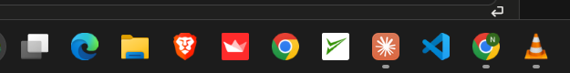

# 04. Reference: the Windows taskbar

| | |
|---|---|
| File | `04-windows-taskbar.png` |
| Size | 625 x 80 px, PNG |
| Source | The owner's own Windows 11 desktop (dark theme), a crop of the taskbar |
| Sent | First batch of corrections, screenshot 4 of 12 |
| Status | Reference: the model for the new bottom bar in a match |

## What the owner said

> "only 3d icons should show I want the options at the bottom instead of a tab I want them to be like this windows task bar Just icons so they can be minimized nicely and also closed"

## In one paragraph

A thin horizontal crop of the Windows 11 taskbar in dark mode: a row of twelve app icons on a near-black bar, with no labels at all. Three of the icons have a small grey pill under them, which is how Windows marks an app that is open. Above the taskbar is the bottom edge of an app window (a text box with a return-arrow symbol). The owner wants the match's bottom controls (Aim, Supplies, Log) to work like this: icons only, a marker for what is open, and windows that can be minimised back into their icon or closed.

## Layout and composition

- **Top 28 px**: the bottom edge of an open window. A thin rounded outline (the border of a text box) runs along the top, a return-arrow symbol ("⏎") sits near the right end (about x 540 to 555, y 5 to 20), and a vertical divider line is at about x 570. Background `#20201f`.
- **A one-pixel separator** divides the window from the taskbar.
- **The taskbar** (about 52 px tall): background `#1c1c1c`. Twelve icons on one row, each about 30 px, centred on about 55 px spacing, vertically centred at about y 51. The row continues past the left edge of the crop.
- **Open-app markers**: small rounded grey pills (about 8 x 3 px, `#989898`) at about y 73, centred under the icons that are open.

## Element by element (left to right)

1. A circular icon cut off by the left edge of the crop (only its right half shows; dark with a hint of green).
2. **Task View**: two overlapping squares, one grey, one white.
3. **Microsoft Edge**: the blue and green wave.
4. **File Explorer**: a yellow folder with a blue band.
5. **Brave browser**: an orange lion head.
6. A red square app icon with a white crown or boat-like mark (app not identified).
7. **Google Chrome**: the red, yellow and green ring around a blue centre.
8. A white square app icon with a green check-mark swoosh (app not identified).
9. An orange tile with a white starburst; this looks like the Claude app icon. **Open** (grey marker underneath).
10. **Visual Studio Code**: the blue ribbon logo.
11. **Google Chrome** with a green profile badge showing the letter "N" at its top right, a second Chrome profile. **Open** (marker underneath).
12. **VLC media player**: the orange and white traffic cone. **Open** (marker underneath).

## What makes it work (as a model)

- **Icons only**: no text labels; the icon is the whole button. Recognition comes from the picture.
- **Constant and small**: the bar is always there, always the same height, and never grows with content.
- **State at a glance**: the tiny marker says "this one is open" without any text. (In Windows, the app in the foreground also gets a longer, brighter marker; here all three markers are the short grey kind, so none of the open apps is in the foreground in this crop.)
- **Click behaviour**: in Windows, clicking an icon opens its window; clicking the icon of the window that is already in front minimises it back to the bar; each window also has its own minimise and close buttons in its title bar. Minimising animates the window down into its icon, so you can see where it went.
- **Equal spacing and one size**: every icon sits in the same square cell, so the row reads as one calm object.

## Notes for the redesign (observations only, nothing built yet)

- The owner's intent: replace the current Aim / Supplies / Log tab switcher at the bottom of the match screen with a taskbar of **3D icons**, one per tool.
- Each tool opens as a window (the keypad, the supplies, the log) that can be **minimised** back into its icon or **closed**, with a marker under the icon while it is open.
- "3D icons" means small rendered objects in the game's clay toy style (for example a keypad or cannon for Aim, a supply crate for Supplies, a notebook for the Log) rather than the flat line icons used now.
- The supplies themselves are meant to become three 3D icons as well (see screenshots 01 and 03), so the Supplies icon could open a small tray of the three.
- Mobile needs thought: a taskbar row fits a phone well, but "windows" on a phone would open as panels from the bottom.

## Colour (sampled from the screenshot)

| Where | Hex |
|---|---|
| Taskbar background | `#1c1c1c` |
| Window above the taskbar | `#20201f` |
| Open-app marker | `#989898` |

## Where the current equivalent lives in the code

- The bottom switcher that this would replace: `web/src/client/index.html`, `#switchRow` with `#switch` (the `role="tablist"` with Aim, Supplies and Log buttons) and `#tauntBtn`.
- Styles: `.switch`, `.switch .thumb`, `.switch button` in `web/src/client/style.css`.
- Logic: `pane()`, `thumb()` and `fitPanes()` in `web/src/client/match.js`.
