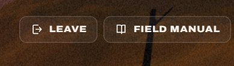

# 05. The Leave and Field manual buttons (desktop)

| | |
|---|---|
| File | `05-leave-and-manual-buttons.png` |
| Size | 389 x 111 px, PNG |
| Source | Dead & Injured, live build, the top right corner of the desktop match screen |
| Sent | First batch of corrections, screenshot 5 of 12 |
| Status | Current UI, to be replaced |

## What the owner said

> "noo need for these two we need one Pause button instead that opens a menu having quit game and manual and other stuff like that"

## In one paragraph

A close crop of the two text buttons in the top right corner of the desktop match screen: **LEAVE** (with an exit icon) and **FIELD MANUAL** (with an open-book icon). They are "ghost" buttons: a dark translucent fill, a thin light border and white uppercase lettering, sitting over the dusk sky and a black silhouette of a dead tree. The owner wants both gone, replaced by a single Pause button that opens a menu with quit, the manual and other options.

## Layout and composition

- **LEAVE**: about x 33 to 162, y 29 to 72 (129 x 43 px).
- **FIELD MANUAL**: about x 173 to 383, y 29 to 72 (210 x 43 px).
- Gap between them: about 11 px. Both share the same height, corner radius (about 12 px) and baseline.
- The sound button (a round speaker icon) normally sits to the right of these two; it is outside this crop.
- Background: the dark brown dusk sky (`#482a18` to `#4c2c13`) with the trunk and branches of a black dead tree rising between and behind the two buttons (the trunk passes behind the gap at about x 165).

## Element by element

### LEAVE

- **Icon**: an exit symbol, a door-frame bracket open to the right with an arrow pointing out of it, drawn as a 1.8 px outline in white.
- **Label**: "LEAVE", white, bold, uppercase, wide letter spacing.
- **Behaviour**: shown only during the supply draw, deploy and battle phases. It opens a "Leave the field?" dialog ("Leaving now hands the win to your opponent.") with **Leave** and **Stay** buttons.

### FIELD MANUAL

- **Icon**: an open book, outline style.
- **Label**: "FIELD MANUAL", white, bold, uppercase, wide letter spacing.
- **Behaviour**: opens the "How the war is fought" dialog with the rules, the dead/injured legend, a worked example and the supply list.

### Styling shared by both

- Fill: dark and translucent, so the sky tints it (sampled `#473123` inside the LEAVE button over a `#482a18` sky).
- Border: one pixel, light and translucent.
- On phones both buttons shrink to square icon-only buttons with no labels.

## Typography

- Archivo, heavy weight, uppercase, tracked out. About 13 px in CSS (the `.btn.sm` size).

## What is wrong with it

1. **Web chrome in a game**: labelled outline buttons in the corner read like a website's navigation bar, not like a game's HUD.
2. **Two controls where games use one**: quitting and reading the rules are both "step out of the match" actions, and games group them behind Pause.
3. **Always visible**: they take space and attention during every turn even though they are used rarely.
4. **Leave is too easy to hit**: a destructive action sits permanently one click away (it is guarded by a dialog, but it still sits in the HUD).

## Notes for the redesign (observations only, nothing built yet)

- One **Pause** button (an icon, probably top right), also opened with the Escape key.
- The pause menu would hold: **Resume**, **Field manual**, sound (and possibly other settings), and **Quit game** (with the existing "this hands the win to your opponent" warning in a live match).
- Pause can truly freeze a match against the computer. In an online match the opponent's clock cannot stop, so there the menu would open while the turn timer keeps running, and the menu should say so.
- The menu itself should be styled from the game's world (see the title screen references 07 to 09) rather than as a web dialog.

## Where it lives in the code

- Markup: `web/src/client/index.html`, the `header.top` element: `#leaveBtn` (`.btn.ghost.sm.leave`), `#manualBtn` (`.btn.ghost.sm`) and `#soundBtn` (`.icon-btn.sound`); the dialogs `#leaveDlg` and `#manualDlg`.
- Styles: `.btn.ghost`, `.btn.sm`, `.leave` (hidden unless a match is in the supply, deploy or battle phase), and the phone rule that hides the labels.
- Logic: `web/src/client/main.js` (manual and sound) and `web/src/client/match.js` (the leave dialog and `{ t: "leave" }`).
