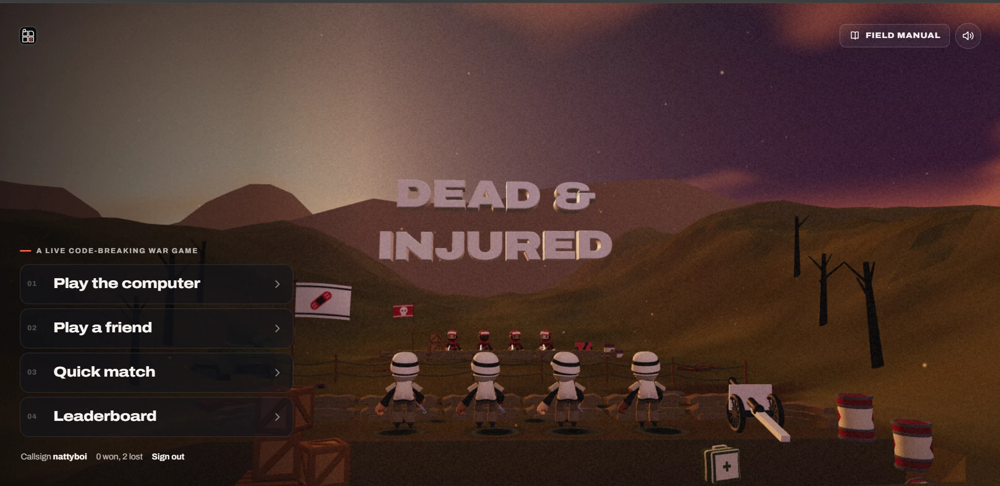

# 06. The current title screen (desktop)

| | |
|---|---|
| File | `06-title-screen-current.webp` |
| Size | 1919 x 933 px, WebP (a full desktop browser viewport) |
| Source | Dead & Injured, live build, the main menu after "Enter the field", signed in as the callsign **nattyboi** |
| Sent | Second batch of corrections, screenshot 6 of 12 |
| Status | Current UI. The owner's verdict: "kinda trash and AI like" |

## What the owner said

> "I want to improve the title screen the current TITLE screen is kinda trash and AI like see a good example of a title screen see how immersed In the games graphics and universe it doesn't look out of place it looks like part of the game sef THe graphics The controls everything Looks like part of the game perfectly in sync which is what I want please"

The good examples are screenshots 07 (Zelda: Breath of the Wild), 08 (Bayonetta Origins: Cereza and the Lost Demon) and 09 (Plants vs. Zombies).

## In one paragraph

The live 3D battlefield at dusk fills the screen. The camera stands behind the player's trench, low, looking across no man's land at the enemy line and the hills beyond. A big extruded 3D title, **DEAD & INJURED**, hangs in the air above the far hills in the centre. On the left, in front of a dark gradient, sits a very ordinary website menu: a small tagline with a red dash, then four stacked dark rounded rectangles numbered 01 to 04 (**Play the computer**, **Play a friend**, **Quick match**, **Leaderboard**), each with a chevron, and a plain text line with the player's callsign and record. The top corners hold a small logo tile, a **FIELD MANUAL** outline button and a round sound button. The world is the game's own and it is quite beautiful; the controls are generic web UI laid over it, which is why it reads as "AI like".

## Layout and composition

- **Viewport**: 1919 x 933. A light strip about 3 px tall along the very top edge is the browser window's edge, not part of the game.
- **Three zones**:
  1. **Left column** (x 38 to 562, y 470 to 890): the menu, anchored to the bottom left.
  2. **Centre** (x 720 to 1180, y 340 to 505): the 3D title.
  3. **Bottom centre and right** (y 540 to 933): the battlefield: the player's squad, the enemy line, props.
- **Corners**: logo tile top left (about x 38 to 70, y 52 to 84); Field manual button (about x 1611 to 1822, y 46 to 90) and sound button (about x 1834 to 1882, y 44 to 92) top right.
- The title and the menu are two separate focal points, one in the centre and one at the left edge, with nothing tying them together.
- The camera frames the squad from behind, centred, with the enemy trench in the middle distance and the title above it, so the layout is symmetrical and static except for the menu.

## Element by element

### The sky

- A soft vertical and horizontal gradient: warm grey-brown at the top left (`#493f37`), a hazy bloom of light left of centre (`#8e7363`) like a sun sinking behind cloud, deepening to plum and violet at the top right (`#351d30`), with pink-edged clouds on the right (`#502c3a`).
- Tiny bright specks drift across the sky and field: embers or sparks.

### The land

- **Far mountains**: low-poly, flat-shaded ridges in dusty mauve-brown (`#766252`) across the whole width.
- **Hills**: rolling olive and khaki slopes, darker in shade (`#452814` on the right, `#342215` behind the title).
- **Dead trees**: black leafless trunks with a few crooked branches: a group on the right (about x 1520 to 1700, y 415 to 705) and more on the left, half hidden behind the menu (about x 230 to 400).
- **Ground**: dark dirt in the foreground (`#241710`), sandbag walls along both trenches, a line of barbed-wire posts between them, dark craters.

### The 3D title

- Two lines of chunky, heavy, extruded capitals: "DEAD &" (about x 760 to 1142, y 343 to 405) and "INJURED" (about x 726 to 1175, y 440 to 500). The ampersand is a stylised "&".
- Letter faces are a dusky pink beige (`#be9f94` at the brightest), the extruded sides darker, with a few warm gold highlights on some edges (`#cba47d`, visible on letters such as the R and E of INJURED).
- The letters float in the air above the far hills and are partly softened by the scene's fog and the film grain, so they sit at low contrast against the pink-brown hills.
- They are not attached to anything in the world: no sign, flag, crate or wall carries them.

### The battlefield

- **The player's squad**: four soldiers seen from behind (about x 720 to 1290, y 675 to 830): white helmets with a black band (warm grey in the dusk light, `#a88482`), white tunics, dark sleeves, brown trousers, rifles at their sides, standing in a sandbag trench.
- **The enemy line**: four enemy soldiers in red helmets and red tunics (`#723f2e` in shade) along the far parapet (about x 820 to 1200, y 630 to 690), with a wooden crate and small red props beside them.
- **Flags**: the player's white flag with a red bandage emblem on a pole to the left of the squad (about x 566 to 675, y 543 to 612); a small red flag with a white skull on the enemy side (about x 755 to 795, y 585 to 610).
- **Field gun**: to the right of the squad (about x 1395 to 1515, y 725 to 845): a spoked wheel, a light grey shield and a barrel pointing down to the right.
- **Barrels**: two white barrels with red bands at the right edge (about x 1605 to 1680 and x 1710 to 1790).
- **Medical kit**: a green box with a white cross on the ground at the bottom right of centre (about x 1350 to 1420, y 855 to 925).
- **Crates**: wooden crates stacked at the bottom left, mostly hidden behind the menu (about x 470 to 670, y 740 to 933).

### The menu (left)

- **Scrim**: a dark gradient rises from the bottom of the screen and darkens the left side (on desktop a 560 px wide panel fades from 70% black at the left edge to transparent).
- **Tagline**: a short red dash (`#e2674e`) followed by "A LIVE CODE-BREAKING WAR GAME" (about x 70 to 380, y 481), small uppercase, letter spacing 0.16em, 70% white.
- **Four menu rows**: each about 524 x 76 px, 9 px apart (y 507 to 583, 592 to 668, 677 to 753, 762 to 838):
  - a dark translucent fill (`#181516`), a one-pixel faint border, rounded corners of about 14 px;
  - a small grey index number on the left: "01", "02", "03", "04" (`#4c4b4e`);
  - the label in large heavy white type (`#f8f5f3`, about 26 px on screen): "Play the computer", "Play a friend", "Quick match", "Leaderboard";
  - a thin grey chevron ">" at the right end (about x 532).
- **Player line**: "Callsign **nattyboi**   0 won, 2 lost   **Sign out**" (about x 40 to 355, y 876), small; the callsign and "Sign out" in bold white, the rest grey.

### The corners

- **Logo tile** (top left): the block logo (a 2 x 2 grid of rounded squares, one holding a red mark) in a small dark rounded tile with a light outline. It is also a home button.
- **FIELD MANUAL** (top right): an outline ghost button with a book icon and tracked uppercase label.
- **Sound** (top right): a round outline button with a speaker icon and sound waves.

### Texture

- A fine animated film-grain overlay covers the whole screen, including the UI.

## Typography

- Everything is Archivo, a clean grotesque sans. The menu labels are about 22 px in CSS at weight 800 with a widened width axis; the tagline and index numbers are small, tracked and uppercase; the player line is small sentence case.
- The only display lettering is the 3D title, which uses the same heavy grotesque shapes extruded into clay.

## Colour (sampled from the screenshot)

| Where | Hex |
|---|---|
| Sky, top left | `#493f37` |
| Sky glow, left of centre | `#8e7363` |
| Sky, top right | `#351d30` |
| Pink cloud, right | `#502c3a` |
| Far mountains | `#766252` |
| Hills in shade (right) | `#452814` |
| Hills behind the title | `#342215` |
| Title letter face (brightest) | `#be9f94` |
| Title gold edges | `#cba47d` |
| Menu row fill | `#181516` |
| Menu label | `#f8f5f3` |
| Menu index numbers | `#4c4b4e` |
| Tagline dash | `#e2674e` |
| Foreground ground | `#241710` |
| Player helmet in dusk light | `#a88482` |
| Enemy uniform in shade | `#723f2e` |

Mood: dim, warm, hazy dusk; low contrast overall; the brightest things on screen are the white menu labels.

## Interaction

- Clicking "Play the computer" or "Play a friend" opens a dropdown of extra buttons underneath the row (see screenshots 11 and 12). "Quick match" goes straight to the search screen; "Leaderboard" opens a dialog.
- Hovering a row lightens it and nudges the chevron. Nothing in the 3D scene reacts to the menu; the camera does not move.

## Why it reads as "AI like"

1. **A stock web pattern**: numbered list rows with chevrons, a tracked-caps eyebrow with a coloured dash, dark glassy cards. This is the look of a thousand generated landing pages and SaaS dashboards.
2. **Two visual languages**: a hand-made clay toy world, then flat HTML rectangles laid over it. Nothing in the menu shares the world's materials, lighting or shapes.
3. **The UI does not belong anywhere**: the menu floats in front of a gradient; the title floats in the sky. Neither is painted on, carved into or hanging from anything.
4. **Split attention**: title in the centre, menu at the left edge, controls in the corners, and a squad in the middle, with nothing leading the eye from one to the next.
5. **Nothing happens**: choosing an option does not move the camera or change the scene; the world is a wallpaper behind the menu.
6. **Website furniture in the corners**: an outline "FIELD MANUAL" button and a round sound button read like site navigation.
7. **Low contrast title**: the pink beige letters melt into the pink brown hills and fog, so the name of the game is the weakest element on screen.

## What the references suggest instead (observations only, nothing built yet)

From 07, 08 and 09, the qualities the owner is pointing at:

- **The world is the menu**: in Plants vs. Zombies the modes are carved on a tombstone and the options are flower pots; in Cereza the whole title screen is the storybook you open. For a trench war game the equivalents are things like a signpost of planks nailed together, stencilled supply crates, a field telephone, a map table, a dog tag with the callsign on it, a white flag, a medal board.
- **Type is minimal and sits in the scene's empty space**: in Breath of the Wild the menu is plain light text in the sky, with a small in-world glyph marking the selection and no boxes at all.
- **The hero is in the frame**: Link stands on a rock looking at the world he is about to explore. Our squad already stands in its trench facing the enemy; a closer, more cinematic camera on one soldier looking over the parapet would carry the same feeling.
- **The logo belongs to the world**: Zelda threads the Master Sword through its logo; Cereza prints the title in gold on the book; here the title could be stencilled on a crate or a banner, painted on the trench sign, or stamped on a dossier.
- **Choosing moves the camera**: the owner's follow-up note (screenshots 11 and 12) asks that every choice moves the camera to a new place in the world where the next set of choices appears, instead of opening a dropdown.

## Where it lives in the code

- Markup: `web/src/client/index.html`, `section#menu` with `.menu-in`, `p.tag`, `nav.menu-list` holding the `.item` buttons and the `#soloSub` and `#friendSub` groups, and `p#who`; the header with `#brand`, `#manualBtn` and `#soundBtn`.
- Styles: `web/src/client/style.css`, `.menu::before` (the scrim), `.menu-in`, `.tag`, `.item`, `.sub`, `.chip`, `.who`, and the desktop block that widens the scrim and the rows.
- 3D title and camera: `web/src/client/scene/director.js`, `titleShow()` and the `title` camera shot (`pos [0, 2.8, 21]`, `look [0, 7.2, -16]`, `fov 44`), with the letters built by `web/src/client/scene/type3d.js`.
