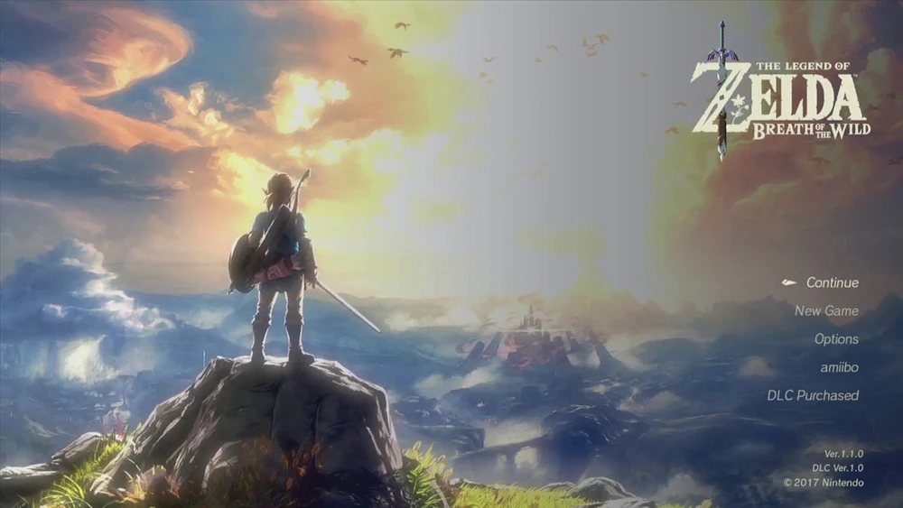

# 07. Reference: The Legend of Zelda: Breath of the Wild, title screen

| | |
|---|---|
| File | `07-title-zelda-breath-of-the-wild.webp` |
| Size | 1000 x 563 px, WebP (16:9) |
| Source | The Legend of Zelda: Breath of the Wild (Nintendo, 2017), the title and start menu |
| Sent | Second batch of corrections, screenshot 7 of 12 |
| Status | Reference: an example of a title screen that belongs to its game |

## What the owner said

> "see a good example of a title screen see how immersed In the games graphics and universe it doesn't look out of place it looks like part of the game sef THe graphics The controls everything Looks like part of the game perfectly in sync which is what I want please"

## In one paragraph

A painterly, sunlit panorama of the game's world. On the left, the hero, Link, stands on the top of a rocky outcrop with his back to us, sword lowered in his right hand, looking out over a vast misty valley toward a distant castle wrapped in a reddish haze. Golden light breaks through towering clouds; a flock of birds crosses the sky. The game's logo sits in the upper right with a sword running through it. Under it, right aligned in the empty bright sky, is the entire menu: five short lines of thin, light type (**Continue**, **New Game**, **Options**, **amiibo**, **DLC Purchased**), with a small white pointer beside the selected line. There are no boxes, panels, buttons or borders anywhere. The menu is just words resting in the world.

## Layout and composition

- **Rule of thirds**: the hero occupies the left third, the castle sits near the centre-right horizon, and the logo and menu stack in the right third.
- **The hero** (Link): about x 255 to 420, y 185 to 400, standing on a dark rock outcrop that rises from the bottom left (about x 150 to 450, y 390 to 563).
- **The vista**: fills the centre, a deep valley with layered ridges fading into mist; the castle at about x 510 to 640, y 335 to 400.
- **Logo**: about x 765 to 965, y 25 to 180.
- **Menu**: right aligned at about x 850 to 952, five lines at about y 312, 344, 375, 406 and 437 (roughly 31 px apart).
- **Version block**: bottom right, about x 870 to 958, y 497 to 537.
- The eye travels in a loop: the hero, along his gaze to the castle, up through the light to the logo, and down to the menu.

## Element by element

### The hero

- Seen from behind, slightly from below, which makes him a silhouette against the bright valley.
- Blue tunic, brown boots and trousers, a round shield slung on his back, hair tied back, a sword held low in his right hand, the blade angled down and to the right and catching the light.
- He stands still, looking out: the pose says "the adventure is out there, and you are about to start it".

### The sky

- Towering cumulus clouds lit gold from behind (highlights around `#d7dbc6`, the sun core about `#dbdbd0`), with cool slate-blue shadows on the left (`#626d81`).
- The centre and right of the sky are washed with pale luminous haze (`#a2a5a8` to `#b4b6ba`), which is the calm space the menu sits in.
- Warm rust and pink cloud edges on the far right (`#655a58`).
- A flock of about a dozen small birds crosses the upper centre and right in a loose, wavering line.

### The land

- Layered valleys and ridges receding into mist; distant mountains in pale blue grey on the left (`#aab5b6`).
- The castle, small on the horizon, surrounded by a reddish mauve glow (`#776875`), the one warm, ominous accent in the view.
- A stone bridge and ruins in the lower middle.
- Bright yellow-green grass tufts in the foreground (`#9aa252`) and dark rock (`#1b1f24`) under the hero.

### The logo

- "THE LEGEND OF" in small capitals above a large "ZELDA" in engraved, slightly flared capitals, with "BREATH OF THE WILD" in smaller capitals beneath.
- The lettering is ivory cream (`#eae7d4` at the brightest) with a subtle bevel.
- A sword (the Master Sword) runs vertically through the logo: its blue-violet hilt above "ZELDA", its blade dropping through the Z and below the words. A small leaf ornament sits beside it. The logo is not a flat wordmark; it contains an object from the game.

### The menu

- Five items, right aligned, one per line: **Continue**, **New Game**, **Options**, **amiibo**, **DLC Purchased**.
- The type is a thin, clean sans (the game's own interface typeface), about 13 px at this size, in light grey.
- **Selection**: "Continue" is brighter (sampled `#c7c2ba`) than the other items (`#9e9c97`), and a small white pointer glyph (a leaf or arrowhead shape in the game's style) sits to its left at about x 866 to 883. No box, highlight bar or underline.
- The items sit directly on the hazy sky, readable because that part of the sky is calm and evenly lit.

### Version block

- "Ver.1.1.0", "DLC Ver.1.0", "© 2017 Nintendo": three tiny right-aligned lines in grey at the bottom right. Present, but almost invisible.

## Typography

- Two voices only: the ornate logo and the thin interface sans. The interface type is small, light and quiet. There is no bold, no uppercase shouting, no letter-spaced labels.

## Colour (sampled from the screenshot)

| Where | Hex |
|---|---|
| Cloud shadow, left | `#626d81` |
| Golden cloud highlight | `#d7dbc6` |
| Sun core | `#dbdbd0` |
| Haze behind the menu | `#a2a5a8` to `#b4b6ba` |
| Warm cloud edge, right | `#655a58` |
| Distant mountains | `#aab5b6` |
| Castle haze | `#776875` |
| Foreground grass | `#9aa252` |
| Rock under the hero | `#1b1f24` |
| Logo lettering | `#eae7d4` |
| Menu, selected | `#c7c2ba` |
| Menu, other items | `#9e9c97` |

Colour story: warm gold light against cool blue shadow, with the red haze on the castle as the single complementary accent. The interface is neutral ivory and grey so it never competes with the art.

## Why it feels part of the game

1. **The art is the game's world at the game's own scale**, not a separate poster: the same land you are about to walk.
2. **The player's avatar is in the frame**, facing the adventure, so the title screen already feels like the first moment of play.
3. **The interface is almost nothing**: a few words in the game's own typeface, placed in the one calm area of the image.
4. **Selection uses an in-world glyph**, not a web-style highlight box.
5. **The logo carries an object from the world** (the sword), so even the branding belongs to the story.
6. **Light and colour lead the eye** from the hero to the menu, so the composition itself does the work that boxes and borders would otherwise do.

## Notes for Dead & Injured (observations only, nothing built yet)

- Our equivalent of the hero shot: one soldier from the player's squad, seen from behind (as the in-game camera already sees them), standing at the parapet at dusk and looking across no man's land at the enemy line, with smoke on the horizon.
- Our menu could be plain type in the game's font, placed in the calm dusk sky, with a small in-world marker for the selected item (a bullet, a crosshair, a tiny flag) instead of rounded boxes.
- Our logo could carry an object from our world, the way this one carries the sword: a rifle, a bandage, a helmet or the skull flag.
- Selecting an item could move the camera along the trench to the next choice (the owner's request in screenshots 11 and 12).
