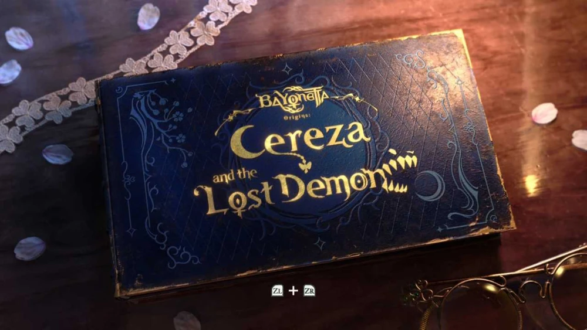

# 08. Reference: Bayonetta Origins: Cereza and the Lost Demon, title screen

| | |
|---|---|
| File | `08-title-cereza-and-the-lost-demon.webp` |
| Size | 1000 x 563 px, WebP (16:9) |
| Source | Bayonetta Origins: Cereza and the Lost Demon (PlatinumGames and Nintendo, 2023, Nintendo Switch), the title screen |
| Sent | Second batch of corrections, screenshot 8 of 12 |
| Status | Reference: an example of a title screen that belongs to its game |

## What the owner said

> "see a good example of a title screen see how immersed In the games graphics and universe it doesn't look out of place it looks like part of the game sef THe graphics The controls everything Looks like part of the game perfectly in sync which is what I want please"

## In one paragraph

The whole title screen is a single physical object: a closed hardcover storybook lying on a dark wooden table. Its deep navy cover is embossed with a fine diamond pattern and decorated with worn gold filigree, stars and a crescent moon; the title is stamped in gold foil in the middle: a small "Bayonetta Origins:" above a large, playful "Cereza" and "and the Lost Demon", whose last letters turn into a row of jagged teeth, like a grin. Around the book lie a strip of white lace, a scatter of pale petals and a pair of antique gold spectacles, lit by warm light from the right and cool shadow on the left. The only interface is a tiny controller prompt at the bottom centre, **ZL + ZR**: press both shoulder buttons to open the book. The game is told as a storybook, so starting it means opening the book.

## Layout and composition

- The book is shown from above at an oblique angle, tilted about 10 degrees counter-clockwise, and fills most of the frame (cover roughly x 160 to 880, y 45 to 510).
- It is placed slightly left of centre so the props have room: lace in the upper left, petals around the edges, spectacles in the lower right corner.
- The title block sits in the optical centre of the cover (about x 330 to 710, y 150 to 370), inside a large oval frame of gold lines.
- The prompt sits under the book at the bottom centre (about x 462 to 540, y 487 to 505).

## Element by element

### The book

- **Cover**: deep navy (`#080c1a` in the darker areas) cloth or leather with a fine embossed diamond crosshatch that catches the light across the whole surface; lighter where the warm light glances across it.
- **Wear**: scuffed corners and edges where the gold and the navy have rubbed away, which makes the book look old, loved and real.
- **Page edges**: gilded; the gold edge shows along the right and bottom sides.
- **Filigree**: gold vine scrolls, small flowers and leaves in the upper-left and lower-left corners; a crescent moon and swirling lines on the right side (about x 715 to 760, y 305 to 345); small four-pointed stars scattered on the cover.

### The title

- Gold foil lettering with bright specular highlights (the brightest gold sampled at `#edd67a`):
  - "BAYONETTA" in its small logotype at the top (about x 440 to 620, y 155 to 185);
  - "Origins:" in a tiny script below it;
  - "Cereza" in a large, whimsical serif with curling swashes (about x 390 to 630, y 205 to 270);
  - a small gold charm (a butterfly or heart shape) hanging on a thin line under "Cereza";
  - "and the" small, then "Lost Demon" large (about x 330 to 650, y 290 to 360);
  - the end of "Demon" dissolves into a row of jagged, tooth-like shapes (about x 650 to 710, y 260 to 330), a grinning monster mouth bursting out of the lettering.

### The props

- **Lace**: a strip of white floral lace ribbon running diagonally across the upper left (about x 0 to 440, y 0 to 260), in soft focus.
- **Petals**: pale petals with a lilac tint in the shade (`#9694be`) scattered on the table: upper left, left edge, bottom centre, right edge.
- **Spectacles**: a pair of round antique spectacles with thin gold wire rims and an ornate bridge, lying in the lower-right corner and cut off by the frame (about x 690 to 1000, y 420 to 563).

### The table

- Dark polished wood (`#100c11` in the shadow on the left), with warm amber light raking in from the right (highlights up to `#e8c979`) that glows and reflects on the top right of the table.

### The prompt

- Two small pale rounded-square button glyphs, "ZL" and "ZR", with a white "+" between them (`#a5a7a2`). No text such as "Press to start"; the glyphs are enough.

## Typography

- There is no interface typography at all. The only letters on screen are the title, printed on the object, in custom display lettering. The prompt uses the console's standard button glyphs.

## Light and mood

- Storybook, intimate and a little magical: warm golden light from one side, cool shadow on the other, a soft vignette in the corners, shallow depth of field (the lace and some petals are blurred).
- It feels like the moment before a bedtime story is read.

## Colour (sampled from the screenshot)

| Where | Hex |
|---|---|
| Cover navy, shadow side | `#080c1a` |
| Gold foil, brightest | `#edd67a` |
| Table in shadow | `#100c11` |
| Warm light on the table | `#e8c979` |
| Petal in shade | `#9694be` |
| Button prompt glyph | `#a5a7a2` |

## Why it feels part of the game

1. **The title screen is a diegetic object**: the game is presented as a storybook, so its title screen is that book, and starting the game is opening it.
2. **The logo is printed on the object**, not laid over the picture.
3. **The props tell the world's story** (lace, petals, spectacles: a childhood, a reader, a magical tale) before a single word is read.
4. **The interface is reduced to one tiny prompt** in the console's own visual language.
5. **Material and light** (foil, emboss, wear, raking light) make it feel physical and precious.

## Notes for Dead & Injured (observations only, nothing built yet)

- A war-game equivalent could make the title screen a physical object from our world: a stamped field dossier or war-room folder ("DEAD & INJURED" stencilled across it, a "TOP SECRET" or "CLASSIFIED" stamp) lying on a map table with dog tags, a compass, a pencil, a tin mug and a candle; or the lid of a supply crate with the title stencilled on it.
- "Start" would then be opening the dossier or prising the crate open, which leads into the menu.
- The prompt could be as small as "Click to open" or a key hint, with no other interface.
- The clay toy style of our game would suit this very well: the soldiers are toys, so the table they are played on could be the frame of the whole game.
