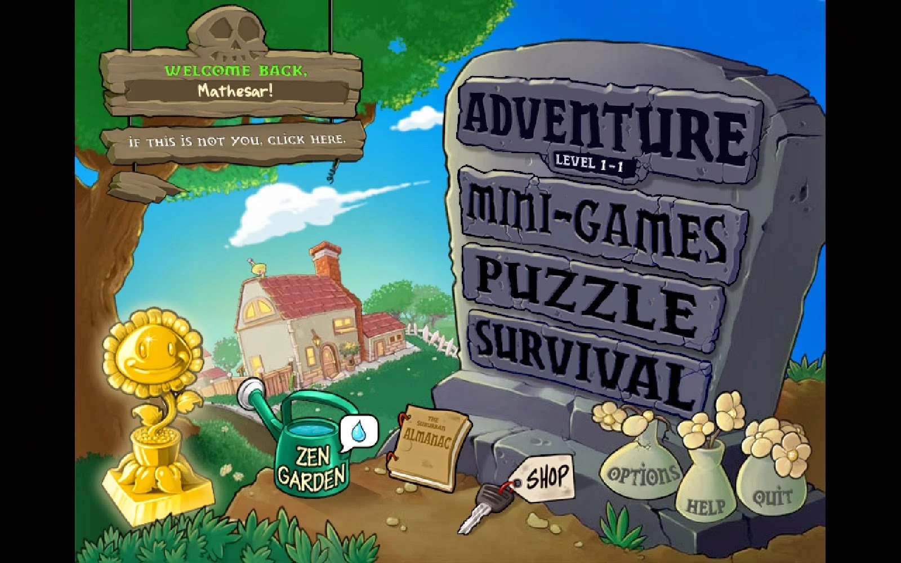

# 09. Reference: Plants vs. Zombies, main menu

| | |
|---|---|
| File | `09-menu-plants-vs-zombies.webp` |
| Size | 1600 x 1000 px, WebP (the 4:3 game image centred with black bars left and right) |
| Source | Plants vs. Zombies (PopCap Games, 2009), the main menu |
| Sent | Second batch of corrections, screenshot 9 of 12 |
| Status | Reference: an example of a menu made entirely from the game's world |

## What the owner said

> "see a good example of a title screen see how immersed In the games graphics and universe it doesn't look out of place it looks like part of the game sef THe graphics The controls everything Looks like part of the game perfectly in sync which is what I want please"

## In one paragraph

A hand-painted cartoon backyard in which every menu control is an object. A huge cracked grey **tombstone** on the right carries the four game modes as stone tablets sticking out of it: **ADVENTURE** (with a small plaque "LEVEL 1-1"), **MINI-GAMES**, **PUZZLE** and **SURVIVAL**. Wooden **signs** hang from a tree on the left under a stone skull: "WELCOME BACK, Mathesar!" and "IF THIS IS NOT YOU, CLICK HERE." Along the bottom, on the dirt, lie the rest of the options: a golden **sunflower trophy**, a green **watering can** labelled "ZEN GARDEN" with a speech bubble holding a water drop, a book called **THE SUBURBAN ALMANAC**, a **car key** with a paper tag reading "SHOP", and three **flower pots** labelled "OPTIONS", "HELP" and "QUIT". Behind it all: a blue sky, a tidy suburban house, a picket fence. There is not a single standard button, panel or font on screen.

## Layout and composition

- **Frame**: 1600 x 1000 with black bars at the left (x 0 to 133) and right (x 1467 to 1600); the painted scene is 1334 x 1000.
- **Left third**: the tree (trunk about x 135 to 260, canopy along the top left) with the hanging signs (about x 178 to 645, y 20 to 345) and the trophy at the bottom (about x 180 to 390, y 570 to 880).
- **Centre**: the house in the middle distance (about x 400 to 720, y 430 to 650), the path, and the watering can, the almanac and the key along the bottom.
- **Right half**: the tombstone (about x 770 to 1466, y 85 to 770) with the four mode tablets stacked diagonally, and the three flower pots at its base (about x 1060 to 1435, y 720 to 920).
- The biggest object on screen is the most important choice (the adventure), and the smallest objects are the least used (options, help, quit).

## Element by element

### The tombstone (the mode selector)

- A tall rounded headstone in blue-grey stone (`#43434f` to `#464554`), chipped at the edges and cracked across its face, set into a mound of dirt (`#92733e`).
- Four stone tablets protrude from its face, each slightly rotated and offset like loose slabs pushed out of the grave, each carved with a mode name in chunky, hand-drawn capitals with near-black outlines (`#010017`):
  - **ADVENTURE** (about x 815 to 1355, y 140 to 280), the largest, with a small black plaque under it reading "LEVEL 1-1" in white: the tablet also shows your progress;
  - **MINI-GAMES** (about x 815 to 1330, y 300 to 430);
  - **PUZZLE** (about x 830 to 1285, y 440 to 560);
  - **SURVIVAL** (about x 830 to 1265, y 555 to 700).

### The hanging signs (the player greeting)

- A stone skull carving sits on top (about x 330 to 470, y 20 to 105), the sign rig hanging on chains or ropes from the tree branch.
- Sign one, a weathered plank (`#7f6b4e`): "WELCOME BACK," in bright green hand lettering (`#67eb30`) and, on a darker inset plank, the player's name "Mathesar!" in white.
- Sign two: "IF THIS IS NOT YOU, CLICK HERE." in white hand lettering; this is the account switcher.
- A small broken plank dangles under the second sign.

### The objects on the ground (the other options)

- **Golden sunflower trophy** (bottom left): a smiling sunflower statue on a stepped gold pedestal, bright gold (`#f6bc03`), a reward for finishing the adventure.
- **Watering can** labelled "ZEN GARDEN" in white hand lettering: bright green (`#1dac7f`), with a white speech bubble holding a blue water drop next to it, a notification that the garden needs attention.
- **The Suburban Almanac**: a tan hardcover book (`#c19959`) tied with red string, leaning on the ground: the encyclopedia of plants and zombies.
- **Car key** with a paper tag on red string reading "SHOP": the shop (it belongs to the game's shopkeeper, who sells from his car).
- **Three flower pots** at the foot of the tombstone, grey-green (`#72766a`) with cream flowers, each with a word painted on it: **OPTIONS**, **HELP**, **QUIT**.

### The backyard

- **Sky**: deep blue at the top (`#0066d6`) fading to pale near the horizon (`#d8ebf3`), with puffy white clouds and a jet contrail.
- **House**: two storeys, red roof (`#ad5b5a`) and chimney, cream walls (`#c9ac8b`), warm lit windows, a small green door, a flower pot on the porch; a small figure appears on the roof.
- **Garden**: a white picket fence, a winding path, hedges and trees, green grass, white daisies and a bush in the foreground.
- **Tree**: leafy green canopy (`#127220`) framing the top left corner.

## Typography

- Every word on screen is hand lettered in the game's cartoon display style and is part of an object: carved into stone, painted on wood, written on a tag or a pot. There is no typed interface text at all.

## Colour (sampled from the screenshot)

| Where | Hex |
|---|---|
| Sky, top | `#0066d6` |
| Sky, near the horizon | `#d8ebf3` |
| Tree canopy | `#127220` |
| Tombstone stone | `#43434f` |
| Carved lettering outline | `#010017` |
| Sign plank | `#7f6b4e` |
| "WELCOME BACK" lettering | `#67eb30` |
| House roof | `#ad5b5a` |
| House wall | `#c9ac8b` |
| Watering can | `#1dac7f` |
| Trophy gold | `#f6bc03` |
| Almanac cover | `#c19959` |
| Flower pot | `#72766a` |
| Dirt mound | `#92733e` |
| Letterbox bars | `#010101` |

## Why it feels part of the game

1. **Every control is an object from the game's world**, and each object matches its meaning: modes on a grave (zombies), settings in flower pots (plants), the shop as the shopkeeper's car key, the encyclopedia as a book, the reward as a trophy.
2. **Personal and alive**: the welcome sign uses your name; the watering can nags you about your garden; the Adventure tablet shows your level.
3. **One art style for everything**: the same brush, outline weight, lighting and palette as the gameplay, so nothing looks pasted on.
4. **Hierarchy through size and placement**, not through boxes: the most important choice is the biggest slab; rare actions are small pots in a corner.
5. **The scene itself is the game's setting**: the backyard you defend in every level.

## Notes for Dead & Injured (observations only, nothing built yet)

Trench-world equivalents of these objects, for the owner to react to:

- **Modes**: planks nailed to a wooden signpost at the trench corner ("PLAY THE COMPUTER", "PLAY A FRIEND", "QUICK MATCH"), or names stencilled on the sides of stacked supply crates.
- **Greeting**: the callsign stamped on a dog tag hanging from the signpost, or chalked on the trench wall ("Welcome back, nattyboi").
- **Record**: a medal, or tally marks scratched on a sandbag, for wins and losses.
- **Leaderboard**: a roll of honour or a board of medals.
- **Field manual**: the manual as a book lying on a crate.
- **Sound**: a field radio or gramophone that can be switched on and off.
- **Quit / sign out**: a white flag, or a coat hook where the helmet hangs.
- Everything built in the same clay toy style and dusk lighting as the battlefield.
