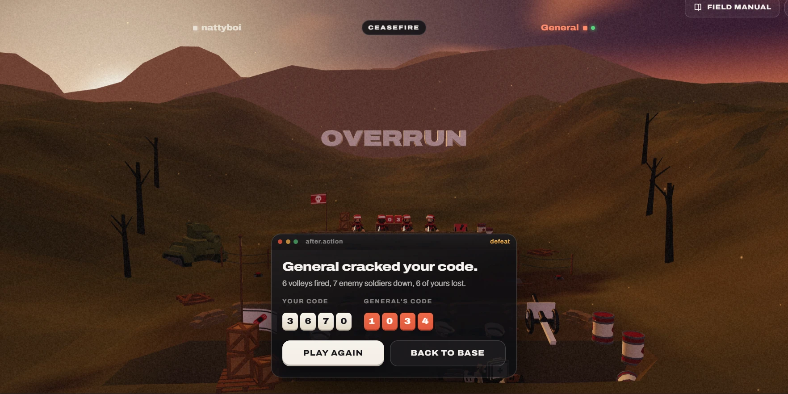

# 10. The current defeat screen (desktop)

| | |
|---|---|
| File | `10-defeat-screen-current.webp` |
| Size | 1764 x 882 px, WebP (a desktop viewport, cropped slightly at the right) |
| Source | Dead & Injured, live build, the end of a match lost to the computer at General rank |
| Sent | Second batch of corrections, screenshot 10 of 12 |
| Status | Current UI, to be made immersive |

## What the owner said

> "and the losing screen to should be immersed In the game the play again or give up should feel immersed in the game please pretty pretty please"

## In one paragraph

After the General cracks the player's code, the camera pulls far back and high behind the player's trench so the whole field is visible at dusk. A 3D word, **OVERRUN**, hangs small and pale above the far hills. The heads-up display at the top shows the player's name (nattyboi), a dark **CEASEFIRE** pill and the opponent's name (General, in red, with an online dot). Over the bottom centre sits a dark window styled like a desktop application: a title bar with three coloured dots, the label **after.action** and the word **defeat** in amber; then "General cracked your code.", a one-line summary ("6 volleys fired, 7 enemy soldiers down, 6 of yours lost."), both codes as tiles (YOUR CODE 3 6 7 0 in cream, GENERAL'S CODE 1 0 3 4 in red) and two buttons: **PLAY AGAIN** and **BACK TO BASE**. The loss is reported by a software dialog; nothing in the world shows that the player's squad was overrun.

## Layout and composition

- **Camera**: the "far" shot, high behind the player's trench, looking over the whole field toward the enemy line and the mountains.
- **Top band** (y 40 to 80): the HUD. "nattyboi" at about x 432 to 540, the CEASEFIRE pill at about x 810 to 953, "General" at about x 1210 to 1333. The Field manual button is cut off at the top right corner (about x 1535 to 1745, y 0 to 38).
- **Middle**: the 3D word OVERRUN (about x 718 to 1044, y 288 to 330) above the enemy trench (about x 760 to 1100, y 470 to 520).
- **Bottom centre**: the after-action window (about x 608 to 1156, y 522 to 845, roughly 548 x 323 px), covering the player's trench and squad entirely.
- The composition is centred and symmetrical; the window sits exactly where the player's own soldiers are.

## Element by element

### The world

- **Sky**: a pale sunset glow at the top left (`#c8b39a`) behind the mountains, deepening to violet at the top right (`#542a37`) with pink-edged clouds.
- **Mountains**: low-poly rust-brown ridges (`#754535`).
- **Hills**: olive brown, dark in shade (`#311f0f`).
- **Dead trees**: black silhouettes at the left (about x 250 to 360) and right (about x 1435 to 1510).
- **Tank**: an army-green tank on the left slope (about x 360 to 510, y 495 to 590), dark in the shade.
- **Enemy trench**: four enemy soldiers in red at the far parapet, their revealed code blocks behind them with digits showing (a "0" and a "3" are visible on red blocks), a small red skull flag on a pole, crates and props.
- **Player's side**: the white flag with the red bandage emblem at the bottom left of the window, wooden crates at the bottom left, the field gun at the bottom right (about x 1175 to 1255, y 655 to 770), red and white barrels at the right, debris and planks on the ground. The player's squad is hidden behind the window.
- **Film grain** over everything.

### The 3D word

- "OVERRUN" in chunky extruded capitals with a pale mauve face (`#9b7671`), hazy in the distance, small relative to the screen (about 326 px wide on a 1764 px frame).
- Other endings use other words: CRACKED (the player won by cracking the code), VICTORY, FORFEIT, STALEMATE.

### The HUD

- **nattyboi**: dim grey-white text with a small grey square marker.
- **CEASEFIRE**: a dark pill (`#201b1b`) with a thin border and white tracked uppercase lettering.
- **General**: coral red (`#fd8866`) with a small red square marker and a green online dot.

### The after-action window

- **Title bar** (`#191718`): three dots, red `#c24831`, amber `#bb8239`, green `#3f8856`, like macOS window controls (decorative only); the label "after.action" in grey, styled as a file name; the word "defeat" right aligned in amber (`#dd9e43`).
- **Body** (`#120f13`):
  - headline "General cracked your code." in large heavy white type;
  - summary "6 volleys fired, 7 enemy soldiers down, 6 of yours lost." in grey;
  - two labelled code groups side by side: "YOUR CODE" with four cream tiles (`#e4dbca`) reading 3 6 7 0, and "GENERAL'S CODE" with four coral-red tiles (`#d7573b`) reading 1 0 3 4 in white;
  - two buttons in a row: **PLAY AGAIN** (about x 632 to 860, y 762 to 818), a solid cream key (`#f5f1e9`) with dark text and a darker bottom edge that makes it look like a raised key; **BACK TO BASE** (about x 873 to 1131), dark (`#1a191c`) with a thin border and white text.

## Typography

- Archivo throughout: a large heavy headline, a regular summary line, small tracked uppercase labels, heavy tabular numerals in the tiles, heavy tracked uppercase button labels.

## Colour (sampled from the screenshot)

| Where | Hex |
|---|---|
| Sky glow, top left | `#c8b39a` |
| Sky, top right | `#542a37` |
| Mountains | `#754535` |
| Hills in shade | `#311f0f` |
| OVERRUN letter face | `#9b7671` |
| Window title bar | `#191718` |
| Window body | `#120f13` |
| Dots: red, amber, green | `#c24831`, `#bb8239`, `#3f8856` |
| "defeat" label | `#dd9e43` |
| Your code tiles | `#e4dbca` |
| Their code tiles | `#d7573b` |
| PLAY AGAIN fill | `#f5f1e9` |
| BACK TO BASE fill | `#1a191c` |
| CEASEFIRE pill | `#201b1b` |
| Opponent name | `#fd8866` |
| Ground | `#3e2310` |

## What the player can do here

- **Play again**: against the computer it starts a new match at the same rank straight away; in a live match the button reads "Rematch" and asks the opponent.
- **Back to base**: returns to the title screen (this is the "give up" option the owner mentions).
- The HUD's Field manual button still works.

## What is wrong with it

1. **A software dialog, not a war**: "after.action" as a file name and macOS-style window dots belong to a code editor. The owner calls this out directly: the options "should feel immersed in the game".
2. **The loss is not shown in the world**: the squad that was overrun is hidden behind the window; nobody surrenders, no white flag goes up, the enemy does not celebrate.
3. **The key word is weak**: OVERRUN is small, pale and far away, so the emotional beat of the ending is carried by a paragraph of text instead.
4. **Generic buttons**: "Play again" and "Back to base" are standard web buttons, with no link to the fiction (regroup, retreat, call for reinforcements).
5. **Redundant HUD**: the CEASEFIRE pill repeats what the window already says.

## Notes for the redesign (observations only, nothing built yet)

- **Stage the loss in the world**: the player's soldiers drop their rifles or kneel, a white flag rises over the trench, the enemy squad cheers and waves, smoke drifts across. The camera could hold on the player's trench rather than the far view.
- **Make the result an object**: the summary as a telegram, a typed dispatch or a stamped after-action report on paper; the two codes stencilled on crates or chalked on a board.
- **Make the choices objects too**: "Play again" as picking up the rifle, or a field telephone to "call for reinforcements"; "Back to base" as a white flag or a signpost pointing to base.
- **Make the ending word the headline**: OVERRUN large and close, stamped across the scene, perhaps like a rubber stamp on the report.
- The victory screen should get the same treatment with the roles reversed.

## Where it lives in the code

- Markup: `web/src/client/index.html`, `div#over.over` containing `.win.card` with the `.win-bar` ("after.action" and `#overTag`), `#overTitle`, `#overText`, `#overCodes`, `#rematchBtn` and `#homeBtn`.
- Logic: `web/src/client/match.js`, `fillOver()` (headline, summary, codes, button labels) and the `over` branch of `enterPhase()`.
- 3D: `web/src/client/scene/director.js`, the end words (CRACKED, OVERRUN, STALEMATE, VICTORY, FORFEIT) and the `far` camera shot (`pos [0, 6.5, 26]`, `look [0, 3.5, -12]`, `fov 42`).
