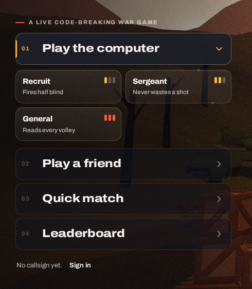

# 11. The title menu with "Play the computer" opened as a dropdown

| | |
|---|---|
| File | `11-menu-dropdown-play-the-computer.png` |
| Size | 490 x 562 px, PNG |
| Source | Dead & Injured, live build, the title screen on desktop after clicking "Play the computer" |
| Sent | Third correction message, screenshot 11 of 12 |
| Status | Current UI. The owner: "sooo unprofesional and soo bad awful loooking" |

**About this image file**: the owner's own screenshot came through in the chat but never reached this session's disk, so it could not be copied. The PNG in this folder is a recapture of the same menu state from the same build. It differs from the owner's screenshot in two ways: it shows "No callsign yet. Sign in" at the bottom (the owner's shows "Callsign **nattyboi**   0 won, 2 lost   **Sign out**"), and the owner's crop was taken at a larger zoom with the left edge of the menu cut off. The description below follows the owner's screenshot.

## What the owner said

> "Anytime the user clicks on any of these action tiles in the title screen its supposed to change the camera view and the new set of action tiles in the games immersive sequence are supposed to show its not supposed to be a dropdown please thats sooo unprofesional and soo bad awful loooking so pleasee pretty pretty pleaseeee lets fix these designs pleaseeeee and improve them"

## In one paragraph

The left-hand menu of the title screen (screenshot 06) with its first row opened. Clicking **Play the computer** turns that row into an "expanded" state (amber number, amber chevron turned downward, an amber bar on its left edge) and pushes a grid of three smaller buttons in underneath it: **Recruit** ("Fires half blind"), **Sergeant** ("Never wastes a shot") and **General** ("Reads every volley"), each with a three-pip difficulty meter. The rest of the menu (Play a friend, Quick match, Leaderboard) slides down to make room. Nothing else on screen changes: the camera, the 3D title and the soldiers stay exactly where they were. It is a web accordion.

## Layout and composition (in the owner's screenshot, 583 x 781 px)

- **Tagline** at the top: a red dash and "A LIVE CODE-BREAKING WAR GAME" (y about 135).
- **Row 01, expanded** (about x 0 to 515, y 162 to 238): "01" in amber, "Play the computer" in large heavy white type, an amber down-pointing chevron at the right, an amber vertical bar on the row's left edge, a slightly lighter fill and a brighter border than the other rows.
- **The three rank buttons** (a two-column grid, 10 px gaps):
  - Recruit (about x 0 to 246, y 252 to 332), top left;
  - Sergeant (about x 258 to 515, y 252 to 332), top right;
  - General (about x 0 to 246, y 344 to 424), bottom left, with an empty cell beside it.
- **Rows 02 to 04** below them (Play a friend, Quick match, Leaderboard), each about 76 px tall with a grey number, white label and grey chevron.
- **Player line** at the bottom: "Callsign **nattyboi**   0 won, 2 lost   **Sign out**".
- **Background**: the dusk hills, dead tree trunks, the player's white flag with the red bandage emblem at the right edge and a wooden crate at the bottom right, all seen through the translucent rows.

## Element by element

### The rank buttons

Each is a rounded rectangle (about 246 x 80 px) with a light translucent fill, a thin light border and a soft lift shadow:

| Button | Title | Note | Pips |
|---|---|---|---|
| Recruit | "Recruit", bold white | "Fires half blind", small grey | 1 of 3 lit (amber), 2 grey |
| Sergeant | "Sergeant" | "Never wastes a shot" | 2 of 3 lit (amber), 1 grey |
| General | "General" | "Reads every volley" | 3 of 3 lit (red-orange) |

- The pips are three small rounded bars in the top right corner of each button.
- The odd number of buttons in a two-column grid leaves a hole next to General, which makes the block look unfinished.

### The expanded row

- Uses amber (the game's "injured" colour) for the number, the chevron and a left accent bar. Hovering any row also lights that bar and slides the row 3 px to the right.

## Typography

- Archivo: the row labels large and heavy (22 px in CSS on desktop), the rank titles bold at about 16 px, the rank notes small and regular, the numbers small and tracked.

## Interaction

- Clicking "Play the computer" toggles this group open (and closes the "Play a friend" group if it was open).
- Clicking a rank starts a match against the computer at once.
- Keyboard: the rows are real buttons and can be tabbed through.

## What is wrong with it (the owner's point)

1. **It is a dropdown**, a form control from websites and admin panels, in the middle of a game's title screen.
2. **The world does not react**: the most important decision on the screen (who you fight) changes nothing in the 3D scene.
3. **Layout jumps**: the rows below jump down to make room, and the grid leaves a gap next to General.
4. **Everything is the same flat card**: ranks, modes and the player line are all rounded rectangles with small grey captions.

## What the owner wants instead

- Clicking an option on the title screen **moves the camera** to a new place in the world, where **the next set of choices appears as part of that place**, like a scene in the game rather than a menu opening.
- For this option, for example (ideas only, to be confirmed): the camera travels across no man's land to the enemy trench, where the three enemy commanders stand to be chosen, each shown as a toy soldier with rank insignia (one chevron for Recruit, two for Sergeant, stars for General) and a short line of character ("Fires half blind"). Hovering one makes him step forward or salute; clicking him starts the match. A "back" control returns the camera to the title position.

## Where it lives in the code

- Markup: `web/src/client/index.html`, `button.item[data-open="soloSub"]` and `div#soloSub.sub` holding three `button.chip[data-level]` (recruit, sergeant, general) with `.pips`.
- Styles: `web/src/client/style.css`, `.item`, `.item[aria-expanded="true"]`, `.sub` (the two-column grid), `.chip`, `.pips`.
- Logic: `web/src/client/main.js`, the `[data-open]` toggle and `solo(level)`; rank names and notes come from `LEVELS` in `web/src/client/ai.js`.
