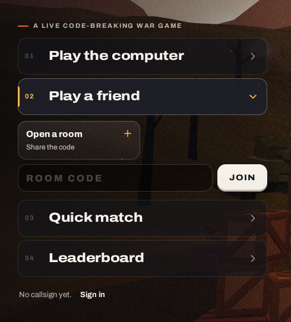

# 12. The title menu with "Play a friend" opened as a dropdown

| | |
|---|---|
| File | `12-menu-dropdown-play-a-friend.png` |
| Size | 490 x 543 px, PNG |
| Source | Dead & Injured, live build, the title screen on desktop after clicking "Play a friend" |
| Sent | Third correction message, screenshot 12 of 12 |
| Status | Current UI. The owner: "sooo unprofesional and soo bad awful loooking" |

**About this image file**: as with screenshot 11, the owner's own screenshot could not be saved from the chat, so this PNG is a recapture of the same state from the same build. The owner's version shows "Callsign **nattyboi**   0 won, 2 lost   **Sign out**" at the bottom where this one shows "No callsign yet. Sign in", and it was taken at a larger zoom (713 x 707 px). The description follows the owner's screenshot.

## What the owner said

> "Anytime the user clicks on any of these action tiles in the title screen its supposed to change the camera view and the new set of action tiles in the games immersive sequence are supposed to show its not supposed to be a dropdown please thats sooo unprofesional and soo bad awful loooking so pleasee pretty pretty pleaseeee lets fix these designs pleaseeeee and improve them"

## In one paragraph

The same title menu with the second row opened. **Play a friend** switches to its expanded state (amber "02", an amber down chevron, an amber bar on its left edge) and two controls are pushed in beneath it: a small button **Open a room** ("Share the code", with an amber "+" in its corner) and a form row made of a dark text field with the placeholder **ROOM CODE** and a cream **JOIN** button. The rows below (Quick match, Leaderboard) slide down. The camera and the 3D scene stay still. It is a website form inside an accordion.

## Layout and composition (in the owner's screenshot, 713 x 707 px)

- **Tagline** at the top: a red dash and "A LIVE CODE-BREAKING WAR GAME" (y about 97).
- **Row 01** "Play the computer", collapsed (about x 38 to 562, y 123 to 199), with a grey chevron.
- **Row 02, expanded** (about x 38 to 562, y 208 to 284): amber "02", "Play a friend" in large white type, an amber down chevron, an amber bar on the left edge, a lighter fill and brighter border.
- **Open a room** (about x 38 to 294, y 298 to 378): a rounded button half the menu's width, "Open a room" in bold white, "Share the code" in small grey, an amber "+" in the top right corner. The right half of that line is empty.
- **Join row** (y about 390 to 446): a dark field (about x 38 to 446) with the placeholder "ROOM CODE" in large, widely tracked, very dim capitals, and a cream **JOIN** button (about x 458 to 562) with dark text and a raised bottom edge.
- **Rows 03 and 04** (Quick match, Leaderboard) below.
- **Player line** at the bottom: "Callsign **nattyboi**   0 won, 2 lost   **Sign out**".
- **Background**: dusk hills, dead trees, the player's white flag with the red bandage emblem at the right edge, a wooden crate or watchtower corner at the bottom right.

## Element by element

- **Open a room**: creates a private room on the server and moves to the waiting screen, which shows a five-letter room code to share (for example "WXYZQ") with "Share the link" and "Cancel" buttons.
- **ROOM CODE field**: accepts up to five characters, forced to capitals; the placeholder is so dim (26% white on a 45% black field) that it barely reads.
- **JOIN**: submits the code and joins the friend's room.
- A callsign is required for both; without one, the "Pick a callsign" dialog opens first.

## Typography

- Archivo throughout: the row labels large and heavy; "Open a room" bold at about 16 px with a small grey note; the field text 16 px in CSS, heavy, tracked out (0.18em for the placeholder, 0.32em for typed characters); "JOIN" heavy uppercase.

## What is wrong with it (the owner's point)

1. **It is a dropdown with a web form in it**: a text field and a submit button are the least game-like controls there are.
2. **Unbalanced layout**: "Open a room" fills half a line and leaves the other half empty; the field and button below form a different width pattern; the rows below jump down.
3. **The world does not react**: inviting a friend to war changes nothing in the scene.
4. **Weak affordance**: the code field's placeholder is nearly invisible, so it is not obvious that it is a place to type.

## What the owner wants instead

- As with screenshot 11: clicking **Play a friend** should move the camera to a new place in the world where the next choices appear as part of the scene.
- Ideas only, to be confirmed: the camera moves to a signals dugout with a field telephone or radio set. "Open a room" becomes cranking the field telephone, which prints or shows the room code as a radio frequency or call sign on a chalkboard or dog tag; "Join" becomes dialling the friend's code into the telephone's rotary dial or typing it on a telegraph key, with the five characters appearing on stencilled tiles or dials. A back control returns to the title position.
- The owner's other request belongs here too (see `../redesign-requests.md`): when opening a room, the host sets up the match: whether supplies are allowed, how many (1 to 5), and a time limit for the whole match.

## Where it lives in the code

- Markup: `web/src/client/index.html`, `button.item[data-open="friendSub"]` and `div#friendSub.sub` holding `button#createBtn.chip` and `form#joinForm.join` (`input#joinCode`, the JOIN button).
- Styles: `web/src/client/style.css`, `.item[aria-expanded="true"]`, `.sub`, `.chip`, `.join`.
- Logic: `web/src/client/main.js`, the `[data-open]` toggle, `create()` (calls `POST /api/rooms`), the join form handler, and `openRoom()`; the waiting screen is `section#wait`.
